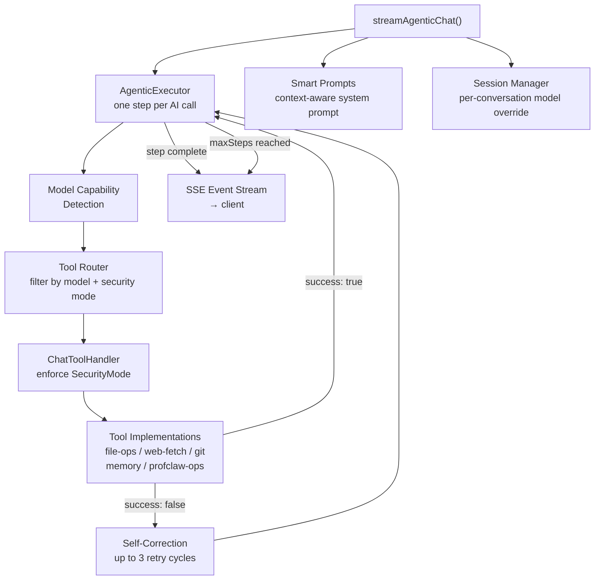
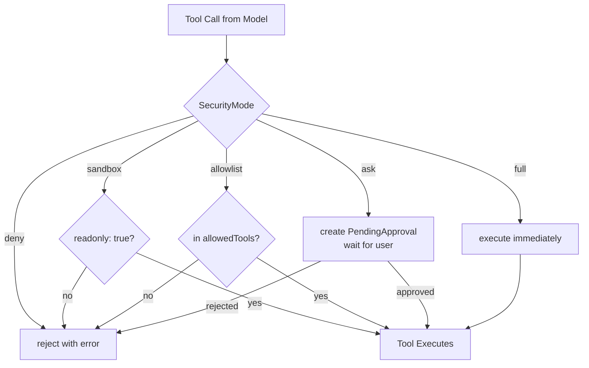

The execution engine (`src/chat/execution/`) drives profClaw's autonomous agent behavior. It wraps the AI SDK in a loop that calls tools, tracks state, enforces security, and streams real-time events.



## Components

```
streamAgenticChat()
    |
    v
AgenticExecutor  <-- executes one "step" (AI call + tool calls)
    |
    v
ChatToolHandler  <-- routes tool calls, enforces security mode
    |
    v
Tool implementations (file-ops, web-fetch, git, memory, profclaw-ops...)
    |
    v
SSE event stream --> client
```

## `streamAgenticChat()`

The main agentic loop entry point from `src/chat/index.ts`:

```typescript
async function* streamAgenticChat(options: {
  conversationId: string;
  messages: ChatMessage[];
  systemPrompt: string;
  model?: string;
  provider?: string;
  temperature?: number;
  toolHandler: ChatToolHandler;
  tools: ToolSchema[];
  showThinking?: boolean;
  maxSteps?: number;
  maxBudget?: number;
  effort?: 'low' | 'medium' | 'high' | 'max';
}): AsyncGenerator<AgenticEvent>
```

The generator yields typed `AgenticEvent` objects that map directly to the SSE events documented in [Chat Stream](/api-reference/chat-stream).

## Effort Levels

The `effort` parameter controls the step budget:

| Effort | Max Steps | Behavior |
|--------|-----------|----------|
| `low` | 5 | Quick tasks, minimal tool use |
| `medium` | 20 | Default, balanced |
| `high` | 50 | Complex tasks, thorough execution |
| `max` | 200 | Exhaustive, use sparingly |

`maxSteps` overrides the effort-derived default.

## Tool Router

`src/chat/execution/tool-router.ts` selects which tools to offer the model based on:

1. **Model capabilities**: Some models don't support all tool types
2. **Security mode**: `sandbox` limits to read-only tools; `allowlist` uses an explicit set
3. **Context**: Agentic mode includes all tools; interactive mode uses the default subset

```typescript
// src/chat/index.ts
function getChatToolsForModel(
  modelId: string,
  options: { conversationId?: string; includeAll?: boolean }
): ToolSchema[]
```

## Security Modes

The `ChatToolHandler` (`src/chat/execution/`) enforces the active security mode on every tool call:

```typescript
type SecurityMode = 'deny' | 'sandbox' | 'allowlist' | 'ask' | 'full';
```

- `deny`: All tool calls rejected with an error
- `sandbox`: Only tools tagged `readonly: true` are allowed
- `allowlist`: Tool name must appear in `allowedTools` list
- `ask`: Creates a `PendingApproval` and waits for user decision
- `full`: All tools execute immediately (used in agentic mode)



## Self-Correction

`src/chat/execution/self-correction.ts` implements automatic retry on tool failure:

- Tool returns `{ success: false, error: "..." }`
- Self-correction sends the error back to the model with a correction prompt
- Model attempts an alternative approach
- Up to 3 correction cycles before the step is marked failed

## Model Capability Detection

`src/chat/execution/model-capability.ts` tracks which models support:

- Native tool calling
- Extended thinking / reasoning tokens
- Large context windows (1M+ token models)
- Streaming

The tool set offered to the model is filtered based on these capabilities to avoid sending tool schemas that the model cannot use.

## Session Manager

`src/chat/execution/session-manager.ts` tracks per-conversation model overrides. When a user selects a different model mid-conversation, `getSessionModel(conversationId)` returns the override which is respected by `streamAgenticChat` and the conversation message endpoints.

## Smart Prompts

`src/chat/execution/smart-prompts.ts` builds context-aware system prompts that include:

- Current task description and status (when `taskId` is linked)
- Linked ticket title and description
- Recent activity stats (completed/pending task counts)
- Runtime model info (`provider/model`)
- Agent mode suffix (for agentic execution)
