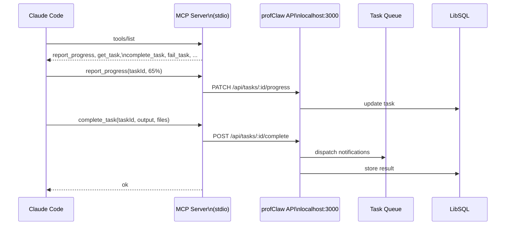
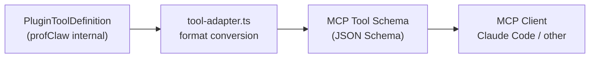

profClaw includes a standalone MCP (Model Context Protocol) server that lets Claude Code and other MCP clients report task progress, track files modified, and interact with the profClaw task queue.



## What is MCP?

The Model Context Protocol is a standard for AI tools to expose capabilities to AI models. profClaw's MCP server exposes profClaw's task management and session tracking as MCP tools.

## Running the MCP Server

The MCP server runs as a separate process communicating over stdio:

```bash
# Via npx
npx @profclaw/task-manager-mcp

# Or directly
node dist/mcp/server.js
```

Configure `PROFCLAW_API_URL` to point at your running profClaw instance:

```bash
PROFCLAW_API_URL=http://localhost:3000 npx @profclaw/task-manager-mcp
```

## Claude Code Integration

Add to `~/.claude/settings.json` (or `.claude/settings.json` in your project):

```json
{
  "mcpServers": {
    "profclaw": {
      "command": "npx",
      "args": ["@profclaw/task-manager-mcp"],
      "env": {
        "PROFCLAW_API_URL": "http://localhost:3000"
      }
    }
  }
}
```

After adding, run `/mcp` in Claude Code to verify the tools are available.

## Available MCP Tools

The MCP server (`src/mcp/server.ts`) exposes these tools to MCP clients:

### `report_progress`

Report task execution progress back to profClaw.

```json
{
  "taskId": "task_01",
  "progress": 65,
  "message": "Running tests...",
  "filesModified": ["src/auth.ts", "src/auth.test.ts"]
}
```

### `get_task`

Fetch task details from the profClaw queue.

```json
{ "taskId": "task_01" }
```

### `complete_task`

Mark a task as completed with a result summary.

```json
{
  "taskId": "task_01",
  "output": "Fixed the session expiry bug in auth-service.ts. Added test coverage.",
  "filesCreated": ["src/auth.test.ts"],
  "filesModified": ["src/auth.ts"]
}
```

### `fail_task`

Mark a task as failed with an error message.

```json
{ "taskId": "task_01", "error": "Tests failed: 3 assertions failed" }
```

### `get_session_state`

Get the current MCP session state (token usage, files modified, active task).

### Browser Tools

The MCP server also exposes browser automation tools (`src/mcp/browser-tools.ts`) for screenshot capture, navigation, and DOM interaction - useful for visual testing and web scraping tasks.

## Session State

Each MCP server process maintains in-memory session state:

```typescript
interface SessionState {
  sessionId: string;    // mcp-<timestamp>-<random>
  startTime: Date;
  filesModified: string[];
  filesCreated: string[];
  tokenUsage: { input: number; output: number };
  currentTask?: { id: string; title: string; startedAt: Date };
}
```

Session state persists for the lifetime of the stdio connection.

## MCP Server Configuration

```typescript
const server = new Server(
  { name: 'profclaw', version: '1.0.0' },
  { capabilities: { tools: { listChanged: true } } }
);
```

The server uses `StdioServerTransport` - it reads from stdin and writes to stdout. This is the standard transport for Claude Code MCP integrations.

## Tool Adapter

`src/mcp/tool-adapter.ts` converts profClaw's internal tool format (`PluginToolDefinition`) to the MCP tool schema format, allowing all installed profClaw tools to be exposed via MCP if desired.



## REST API for MCP

The MCP route (`src/routes/mcp.ts`) provides HTTP endpoints for managing MCP server configuration and viewing connected MCP clients:

```
GET /api/mcp/servers     # List configured MCP servers
POST /api/mcp/servers    # Add an MCP server config
DELETE /api/mcp/servers/:id
GET /api/mcp/tools       # List all tools from connected servers
```
