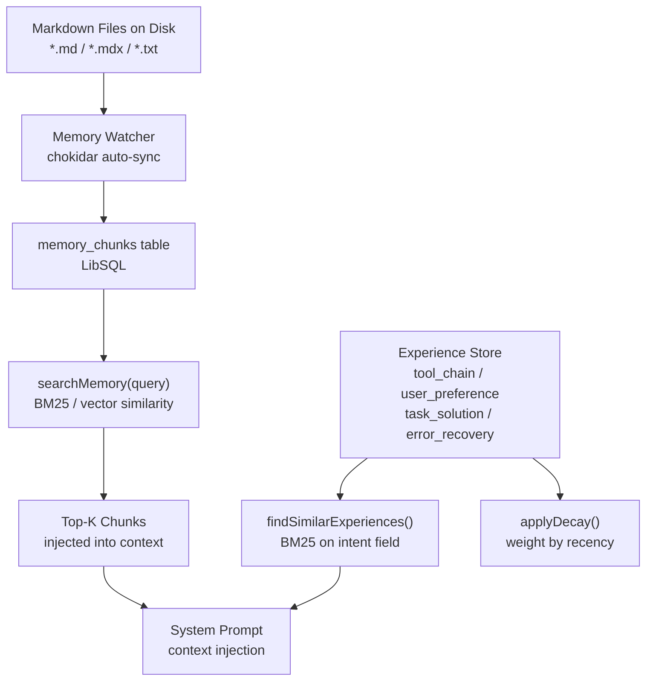
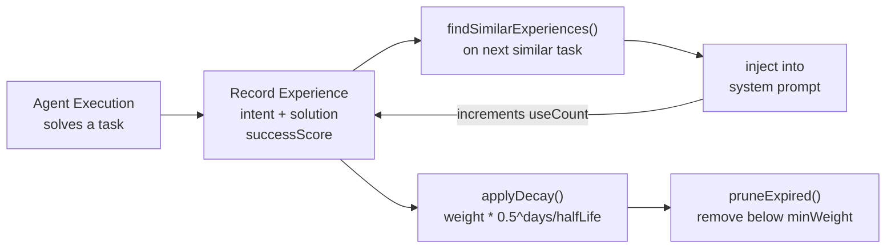

profClaw's memory system has two layers: **file memory** (markdown files indexed for semantic search) and the **experience store** (learned tool chains and user preferences).



## File Memory

The file memory layer (`src/memory/`) indexes markdown files into chunks stored in LibSQL. At query time, it uses BM25 full-text search (or vector search when available) to find relevant context.

### Architecture

```
Markdown files on disk
        |
        v
syncMemoryFiles(basePath)  <-- chunkifies each file
        |
        v
memory_chunks table (LibSQL)
  - id, path, startLine, endLine, text, hash
        |
        v
searchMemory(query)  <-- BM25 or vector similarity
        |
        v
Top-K chunks returned to caller
```

### Chunking

Files are split into overlapping chunks of configurable size (`DEFAULT_MEMORY_CONFIG.chunking`). Each chunk stores:

- `path`: relative file path
- `startLine` / `endLine`: line range in the source file
- `text`: raw chunk content
- `hash`: content hash for change detection (avoids re-indexing unchanged chunks)

### Auto-Sync (Memory Watcher)

`src/memory/memory-watcher.ts` watches the configured paths with `chokidar` and triggers incremental re-sync when files change:

```typescript
interface MemoryWatcherState {
  dirty: boolean;       // Files changed since last sync
  syncing: boolean;     // Sync in progress
  lastSyncAt: Date | null;
  watchedFiles: number;
  watching: boolean;
}
```

When `dirty` is true, the next `searchMemory()` call automatically triggers a sync before returning results (`autoSynced: true` in the response).

### Memory Config

```typescript
const DEFAULT_MEMORY_CONFIG = {
  sources: ['local'],
  provider: 'libsql',
  chunking: {
    maxChunkSize: 1500,
    overlapSize: 200,
    splitOnHeaders: true,
  },
  query: {
    maxResults: 6,
    minScore: 0.1,
  },
  sync: {
    onSessionStart: true,
    onSearch: true,
    watch: true,
    watchDebounceMs: 2000,
  },
  paths: {
    include: ['**/*.md', '**/*.mdx', '**/*.txt'],
    exclude: ['node_modules/**', 'dist/**', '.git/**'],
  },
};
```

## Memory Sessions

Memory sessions (`createMemorySession`, `archiveSession`) track which knowledge base was loaded for a given conversation. This enables:

- Session replay (re-load same context)
- Auditing which files influenced a response
- Session isolation (different projects use different memory sets)

## Experience Store

`src/memory/experience-store.ts` records patterns the agent learns from execution:

### Experience Types

```typescript
type ExperienceType =
  | 'tool_chain'        // Sequence of tools that solved a problem
  | 'user_preference'   // User's formatting or style preferences
  | 'task_solution'     // Successful approach to a type of task
  | 'error_recovery';   // How a past error was fixed
```

### Schema

Each experience has:

- `intent`: what the user was trying to do (text for similarity search)
- `solution`: the approach that worked (arbitrary JSON)
- `successScore`: 0-1, quality of the solution
- `weight`: decays over time (updated by `applyDecay()`)
- `useCount`: incremented each time the experience is retrieved and used

### Retrieval

`findSimilarExperiences(query, tags?, limit?)` uses BM25 search on the `intent` field to find past experiences relevant to the current task. The result is injected into the system prompt when available.



### Decay

Experiences are weighted by recency. `applyDecay(halfLifeDays)` reduces the weight of old experiences:

```
weight = weight * 0.5^(daysSinceLastUse / halfLifeDays)
```

`pruneExpired(minWeight)` removes experiences below the minimum weight threshold to keep the store lean.

## Context Management

`getMemoryStats()` and `needsCompaction()` (from `src/chat/index.ts`) track token usage and trigger conversation compaction before the context window fills:

```typescript
function needsCompaction(messages: ConversationMessage[], model?: string): boolean
async function compactMessages(messages: ConversationMessage[], model?: string): Promise<CompactionResult>
```

Compaction summarizes older messages into a single summary block, preserving context while reducing token count.
