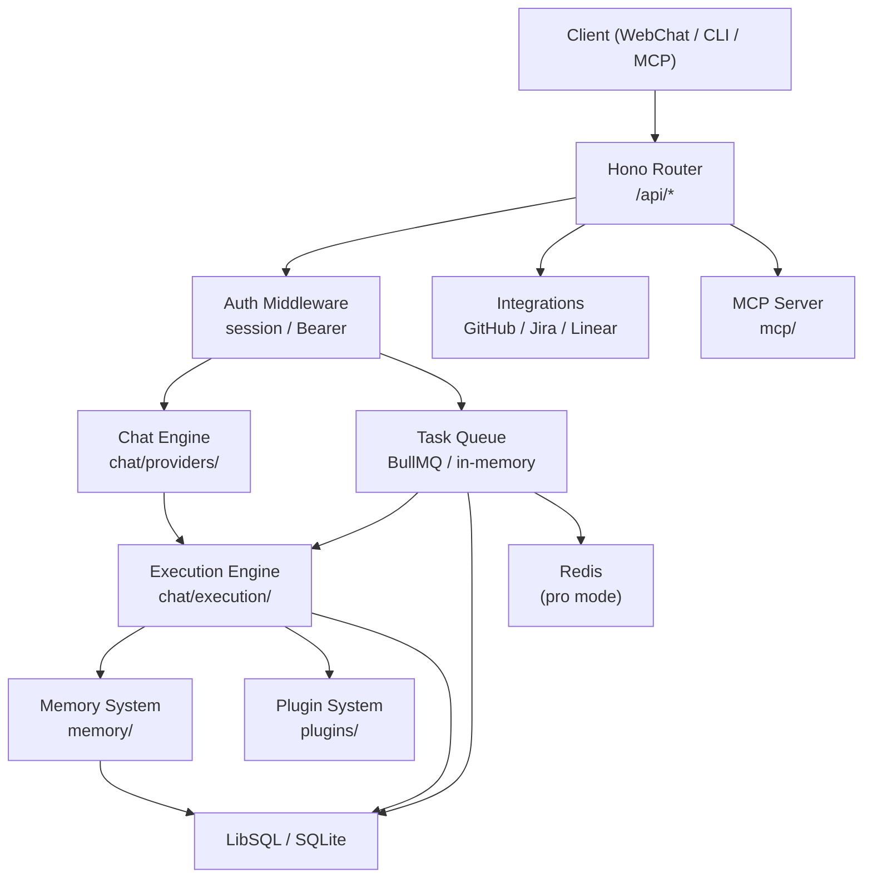
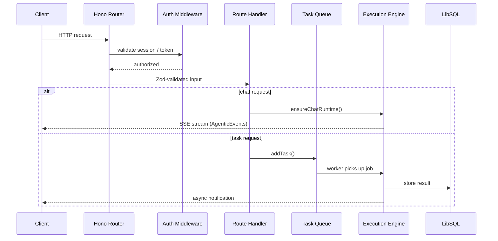

profClaw is a monorepo with a Hono-based API backend and a React 19 frontend. It runs as a single Node.js process (or serverless on Cloudflare Workers) and stores data in LibSQL/SQLite.



## Component Map

```
┌─────────────────────────────────────────────────────────┐
│                    profClaw Server                       │
│                                                          │
│  ┌──────────┐   ┌──────────────┐   ┌─────────────────┐ │
│  │  Hono    │   │  Chat Engine │   │  Execution       │ │
│  │  Router  │──>│  (providers/ │──>│  Engine          │ │
│  │  /api/*  │   │   index.ts)  │   │  (chat/          │ │
│  └──────────┘   └──────────────┘   │  execution/)     │ │
│       │                            └─────────────────┘ │
│       │         ┌──────────────┐                        │
│       ├────────>│  Task Queue  │   BullMQ / In-memory   │
│       │         │  (queue/)    │                        │
│       │         └──────────────┘                        │
│       │                                                  │
│       │         ┌──────────────┐   ┌─────────────────┐ │
│       ├────────>│  Memory      │   │  Plugin System  │ │
│       │         │  (memory/)   │   │  (plugins/)     │ │
│       │         └──────────────┘   └─────────────────┘ │
│       │                                                  │
│       │         ┌──────────────┐   ┌─────────────────┐ │
│       └────────>│  Integrations│   │  MCP Server     │ │
│                 │  (github/    │   │  (mcp/)         │ │
│                 │   jira/      │   └─────────────────┘ │
│                 │   linear/)   │                        │
│                 └──────────────┘                        │
└─────────────────────────────────────────────────────────┘
         │                   │
         v                   v
   LibSQL / SQLite        Redis (optional)
   (storage/)             (pro mode only)
```

## Deployment Modes

```typescript
// src/types/index.ts
type DeploymentMode = 'pico' | 'mini' | 'pro';
```

| Mode | Queue | Storage | Features |
|------|-------|---------|----------|
| `pico` | In-memory | LibSQL file | Single user, local only |
| `mini` | In-memory | LibSQL file | Multi-user, no Redis |
| `pro` | BullMQ + Redis | LibSQL or Turso | Full features, multi-instance |

## Request Flow

1. HTTP request arrives at Hono router (`src/server.ts`)
2. Auth middleware validates session cookie or Bearer token
3. Route handler validates input with Zod schemas
4. For chat: lazy-loaded runtime (`ensureChatRuntime()`) processes with AI SDK
5. For tasks: `addTask()` enqueues to BullMQ or in-memory queue
6. Queue worker picks up task, routes to agent adapter via `AgentRegistry`
7. Agent executes tools via `ChatToolHandler` (respecting security mode)
8. Result stored in LibSQL, notifications dispatched asynchronously



## Storage Layer

All persistence goes through the storage adapter (`src/storage/`):

- **Schema**: Drizzle ORM with LibSQL/SQLite backend
- **Tables**: `users`, `sessions`, `tasks`, `conversations`, `messages`, `memory_chunks`, `experiences`, `provider_configs`, `invite_codes`
- **Migrations**: `src/storage/migrations.ts`

## Key Module Boundaries

| Path | Responsibility |
|------|---------------|
| `src/server.ts` | Hono app creation, route mounting, server startup |
| `src/routes/` | HTTP route handlers (thin, delegate to services) |
| `src/chat/` | Chat engine, conversation management, system prompts |
| `src/chat/execution/` | Agentic executor, tool handler, session manager |
| `src/providers/` | AI SDK provider registry (15+ providers) |
| `src/queue/` | Task queue (BullMQ + in-memory), failure handler |
| `src/memory/` | Memory sync, search, experience store |
| `src/plugins/` | Plugin registry, SDK, sandbox, ClawHub client |
| `src/integrations/` | GitHub, Jira, Linear, Cloudflare, Tailscale clients |
| `src/mcp/` | MCP server for Claude Code integration |
| `src/sync/` | Bidirectional sync engine for ticket platforms |
| `src/auth/` | Session management, OAuth, device identity, pairing |
