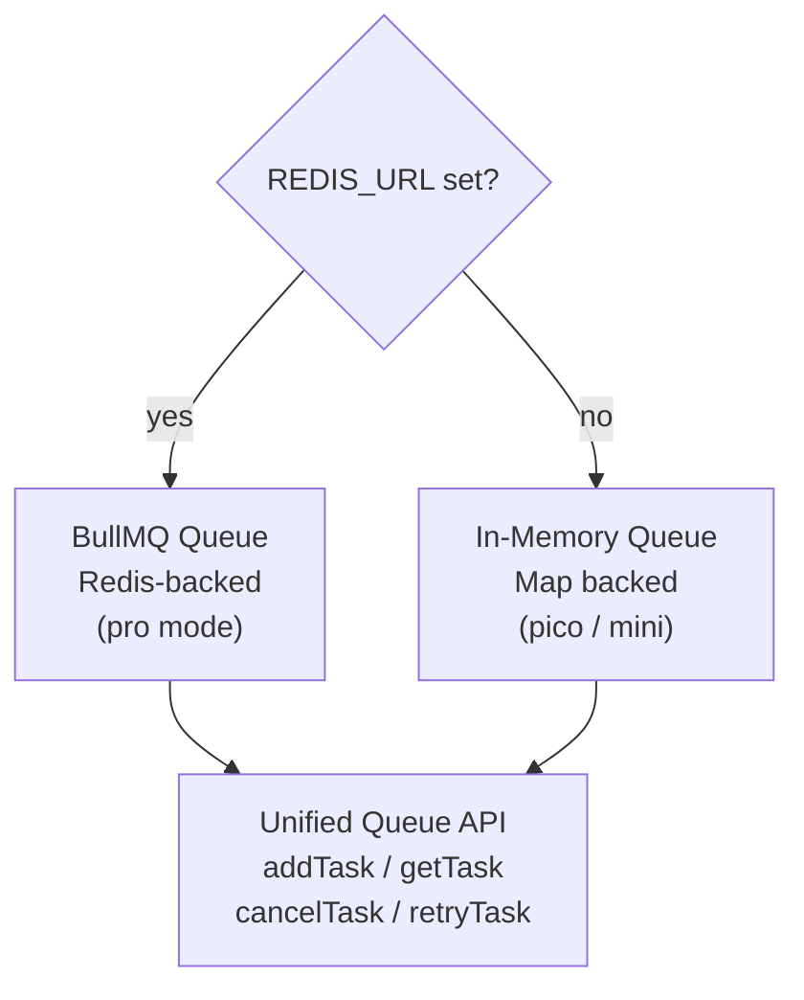
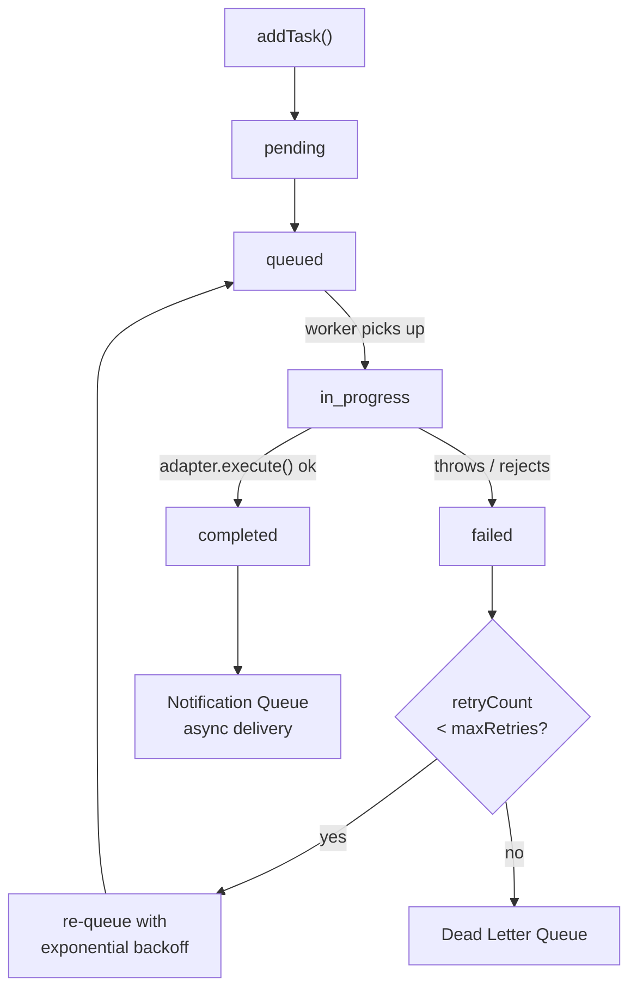
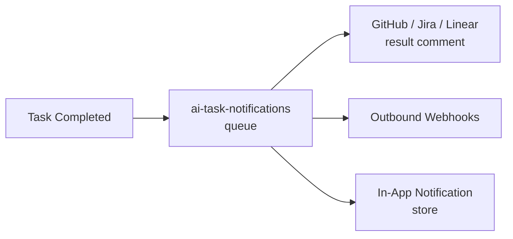

profClaw uses a dual-mode queue: **BullMQ** (Redis-backed) in `pro` mode and an **in-memory queue** in `pico`/`mini` mode. Both implement the same `addTask / getTask / cancelTask / retryTask` interface.



## Task Lifecycle

```
addTask()
    |
    v
[pending] ──────────── BullMQ.add() ───────────> [queued]
                                                      |
                                               Worker picks up
                                                      |
                                                      v
                                               [in_progress]
                                              /             \
                                    adapter.execute()  throws/rejects
                                          |                  |
                                          v                  v
                                    [completed]          [failed]
                                                             |
                                                    retryCount < maxRetries?
                                                    /                \
                                                  Yes                No
                                                   |                  |
                                              Re-queue           Dead Letter Queue
```



## BullMQ Configuration

```typescript
// src/queue/task-queue.ts
const QUEUE_NAME = settings.queue?.name || 'ai-tasks';
const REDIS_URL = process.env.REDIS_URL || settings.queue?.redis?.url;

// Connection
const connection = {
  host: new URL(REDIS_URL).hostname,
  port: parseInt(new URL(REDIS_URL).port || '6379'),
  password: new URL(REDIS_URL).password || undefined,
};
```

The BullMQ queue uses priority-based processing. Tasks with `priority: 1` (critical) are processed before `priority: 4` (low).

## In-Memory Queue

`src/queue/memory-queue.ts` provides a `Map<string, Task>` backed queue with:

- Immediate execution (no separate worker process)
- Same `TaskStatus` state machine
- No persistence across restarts
- Cursor-based iteration not supported (offset only)

The in-memory queue is auto-selected when `REDIS_URL` is not set.

## Queue Index

`src/queue/index.ts` exposes the unified API:

```typescript
export async function addTask(input: CreateTaskInput): Promise<Task>
export function getTask(id: string): Task | undefined
export function getTasks(options?: {
  status?: TaskStatusType;
  limit?: number;
  offset?: number;
}): Task[]
export async function cancelTask(id: string): Promise<boolean>
export async function retryTask(id: string): Promise<Task | null>
```

## Failure Handler

`src/queue/failure-handler.ts` implements the retry and DLQ logic:

```typescript
export async function handleTaskFailure(
  task: Task,
  error: Error,
  attempt: number
): Promise<void>
```

On each failure:

1. Increments `retryCount` on the task
2. If `retryCount < maxRetries` (default 3): re-queues with exponential backoff delay (`backoff * 2^attempt`)
3. If exhausted: moves to DLQ via `initDeadLetterQueue()`
4. Creates an in-app notification for DLQ entries

## Dead Letter Queue

The DLQ (`src/queue/failure-handler.ts` + route `src/routes/dlq.ts`) holds tasks that have exhausted retries:

```typescript
export async function getDeadLetterQueueStats(): Promise<{
  pending: number;
  resolved: number;
  discarded: number;
  total: number;
}>
```

Operators can inspect DLQ entries at `GET /api/dlq`, retry them with `POST /api/dlq/:id/retry`, or discard with `POST /api/dlq/:id/discard`.

## Notification Queue

A separate BullMQ queue (`ai-task-notifications`) handles async notifications after task completion. This keeps notification delivery off the critical path - a slow webhook target doesn't delay the next task from starting.

```typescript
// After task completes:
await notificationQueue.add('notify', { task, result }, { attempts: 3 });

// Worker posts to:
// 1. GitHub/Jira/Linear (result comment on source issue)
// 2. Registered outbound webhooks
// 3. In-app notification store
```



## Webhook Queue

`src/queue/webhook-queue.ts` manages outbound webhook delivery with:

- Per-endpoint retry with backoff
- Deduplication (no double-delivery on restart)
- Delivery log stored in LibSQL
- Health tracking (mark endpoint as failing after N failures)

## Task Store Sync

In BullMQ mode, the in-memory `taskStore` Map acts as a cache. It is populated from the database on startup and kept in sync by the worker event handlers:

```typescript
taskWorker.on('completed', (job, result) => {
  const task = taskStore.get(job.id);
  if (task) {
    task.status = 'completed';
    taskStore.set(job.id, task);
  }
  storage.updateTask(job.id, { status: 'completed', ...result });
});
```
