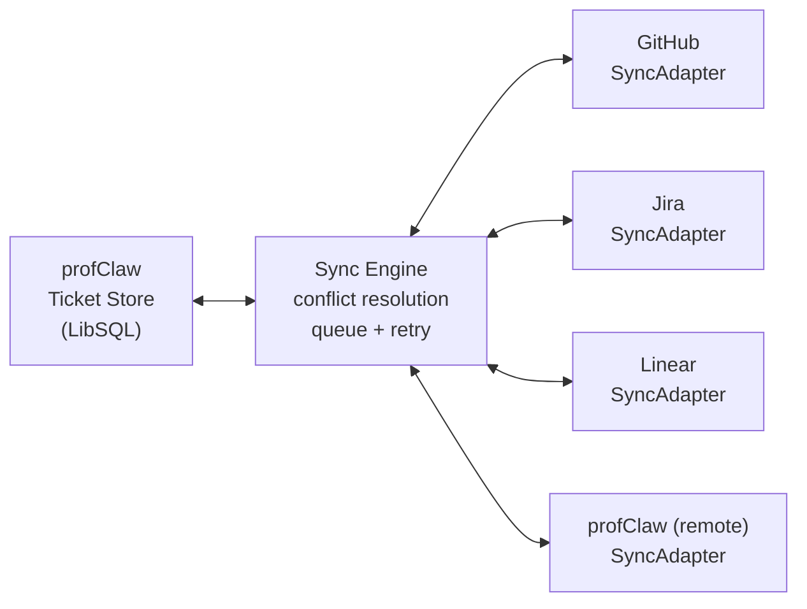
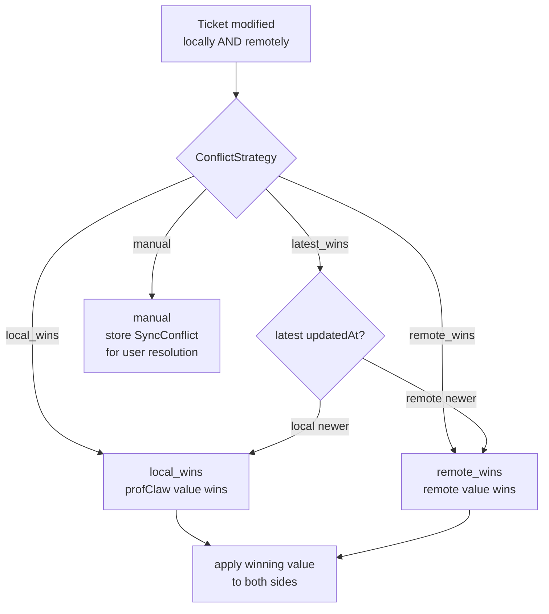
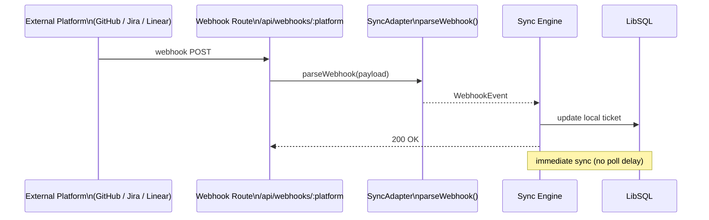

The sync engine (`src/sync/`) provides bidirectional synchronization between profClaw's internal ticket store and external platforms: GitHub Issues, Jira, and Linear.



## Core Types

```typescript
// src/sync/types.ts

export type SyncDirection = 'push' | 'pull' | 'bidirectional';

export type SyncOperationType =
  | 'create' | 'update' | 'delete'
  | 'comment_add' | 'comment_update' | 'status_change';

export type ConflictStrategy =
  | 'local_wins' | 'remote_wins' | 'latest_wins' | 'manual';
```

## SyncAdapter Interface

Each platform implements `SyncAdapter`:

```typescript
export interface SyncAdapter {
  readonly platform: string;
  readonly config: SyncAdapterConfig;

  connect(): Promise<void>;
  disconnect(): Promise<void>;
  isConnected(): boolean;
  healthCheck(): Promise<{ healthy: boolean; latencyMs: number }>;

  createTicket(ticket: Ticket): Promise<ExternalTicket>;
  updateTicket(externalId: string, updates: Partial<Ticket>): Promise<ExternalTicket>;
  deleteTicket(externalId: string): Promise<boolean>;
  getTicket(externalId: string): Promise<ExternalTicket | null>;
  listTickets(options?: ListTicketsOptions): Promise<{
    tickets: ExternalTicket[];
    cursor?: string;
  }>;

  addComment(externalTicketId: string, content: string): Promise<ExternalComment>;
  getComments(externalTicketId: string): Promise<ExternalComment[]>;

  mapStatusToExternal(status: TicketStatus): string;
  mapStatusFromExternal(externalStatus: string): TicketStatus;
  mapPriorityToExternal(priority: TicketPriority): string | number | undefined;
  mapPriorityFromExternal(externalPriority: string | number): TicketPriority;

  parseWebhook?(payload: unknown): WebhookEvent | null;
}
```

## Sync Engine Config

```typescript
export interface SyncEngineConfig {
  conflictStrategy: ConflictStrategy;  // default: 'latest_wins'
  syncIntervalMs: number;               // default: 60000 (1 minute)
  maxRetries: number;                   // default: 3
  retryDelayMs: number;                 // default: 1000
  enableWebhooks: boolean;              // default: true
  platforms: Record<string, SyncAdapterConfig>;
}
```

## Conflict Resolution

When the same ticket is modified locally and remotely between sync cycles, the `ConflictStrategy` determines which value wins:

| Strategy | Behavior |
|----------|----------|
| `local_wins` | profClaw value always overwrites remote |
| `remote_wins` | Remote value always overwrites profClaw |
| `latest_wins` | Whichever has the most recent `updatedAt` wins |
| `manual` | Conflict stored for user resolution |

A `SyncConflict` record is created for every conflict:

```typescript
export interface SyncConflict {
  ticketId: string;
  platform: string;
  field: string;
  localValue: unknown;
  remoteValue: unknown;
  localTimestamp: Date;
  remoteTimestamp: Date;
  resolution?: 'local' | 'remote' | 'merged';
  mergedValue?: unknown;
}
```



## Sync Queue

Operations are queued and processed with retry:

```typescript
export interface SyncQueueItem {
  id: string;
  operation: SyncOperation;
  priority: number;
  createdAt: Date;
  scheduledFor: Date;
  attempts: number;
  maxAttempts: number;
  status: 'pending' | 'processing' | 'completed' | 'failed';
  result?: SyncResult;
}
```



## Webhook-Driven Sync

When webhooks are enabled (`enableWebhooks: true`), inbound webhook events from GitHub/Jira/Linear trigger immediate sync operations instead of waiting for the polling interval:

1. Webhook arrives at `/api/webhooks/:platform`
2. Adapter calls `parseWebhook(payload)` to extract a `WebhookEvent`
3. Sync engine processes the event immediately
4. Local ticket state updated within seconds of the external change

## Pull Sync

On each polling cycle, the engine calls `adapter.listTickets({ updatedAfter: lastSyncAt })` with the cursor from the previous sync. This fetches only changed tickets, minimizing API quota usage.

## Push Sync

When a local ticket is created or updated, a `SyncOperation` is added to the queue. The adapter's `createTicket` or `updateTicket` method is called asynchronously.

## Status and Priority Mapping

Each adapter implements bidirectional mapping functions. For example, the GitHub adapter maps:

```
open issue    <--> TicketStatus.open
closed issue  <--> TicketStatus.closed
```

The Linear adapter maps workflow states by `stateType` (triage, backlog, started, completed, cancelled) to profClaw's `TicketStatus` enum.

## Multi-Device Sync

The sync system also handles profClaw-to-profClaw synchronization for multi-instance setups. Two profClaw instances can sync their task and conversation state over Tailscale or direct HTTP, using the same `SyncAdapter` interface with a `profclaw` platform adapter.
