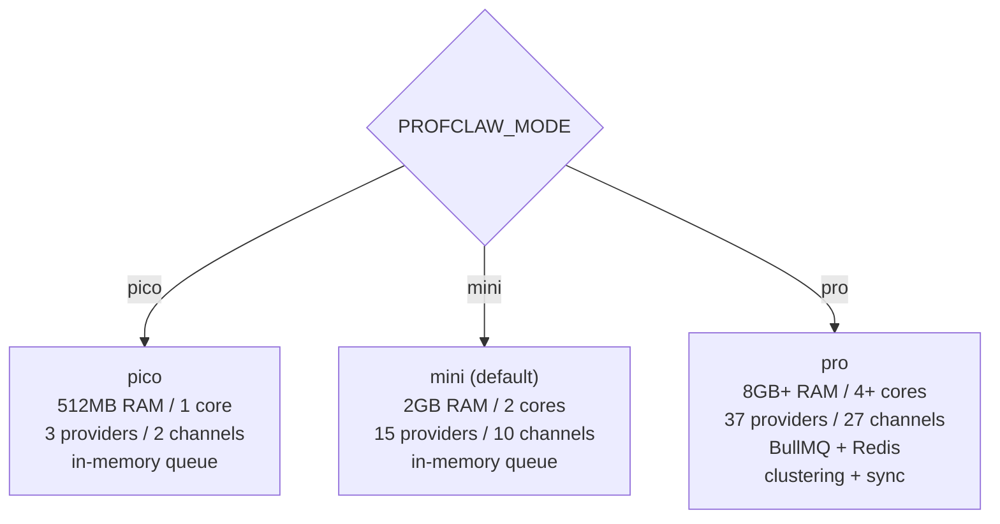
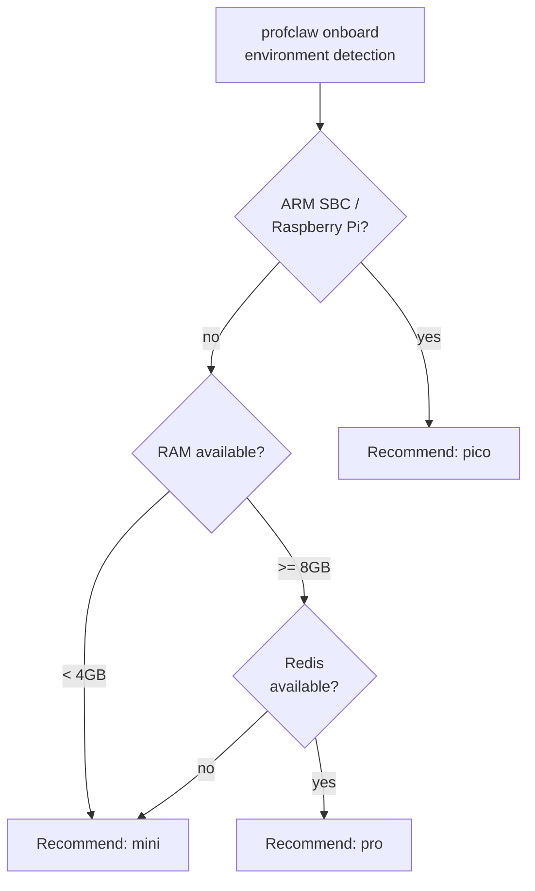

## Overview

profClaw runs in three deployment modes that control resource usage, available features, and scaling behavior. Set the mode via the `PROFCLAW_MODE` environment variable.

```bash
export PROFCLAW_MODE=mini  # pico | mini | pro
```



## Mode Comparison

| Feature | Pico | Mini | Pro |
|---------|------|------|-----|
| **RAM** | 512MB | 2GB | 8GB+ |
| **CPU Cores** | 1 | 2 | 4+ |
| **AI Providers** | 3 | 15 | 37 |
| **Chat Channels** | 2 | 10 | 27 |
| **Tools** | 15 | 50 | 77+ |
| **Skills** | 10 | 30 | 50 |
| **Queue** | In-memory | In-memory | BullMQ + Redis |
| **Max Concurrent** | 5 | 25 | 50+ |
| **Audit Logging** | Basic | Standard | Full |
| **Plugin Support** | No | Basic | Full |
| **MCP Servers** | 1 | 5 | Unlimited |
| **Backup/Restore** | Manual | Scheduled | Continuous |
| **Multi-device Sync** | No | No | Yes |
| **Clustering** | No | No | Yes |

## Pico Mode

Designed for resource-constrained environments like Raspberry Pi, IoT devices, or personal use on older hardware.

```bash
export PROFCLAW_MODE=pico
```

**Included providers**: Ollama, OpenAI, Anthropic
**Included channels**: Webchat, Telegram
**Docker image**: `profclaw/profclaw:pico` (optimized, smaller image)

<Warning>
  Pico mode disables plugins, multi-device sync, and advanced security features to minimize resource usage.
</Warning>

## Mini Mode (Default)

The balanced option for small teams and home servers. Supports most features without requiring Redis.

```bash
export PROFCLAW_MODE=mini
```

**Key features**:
- 15 AI providers including all major cloud providers
- 10 chat channels including Slack, Discord, Telegram
- Background task processing with in-memory queue
- Standard audit logging
- Basic plugin support

## Pro Mode

Full-featured production mode. Requires Redis for the BullMQ job queue.

```bash
export PROFCLAW_MODE=pro
export REDIS_URL=redis://localhost:6379
```

**Key features**:
- All 37 AI providers
- All 27 chat channels
- Redis-backed job queue with persistence and retry
- Full audit logging with compliance support
- Plugin marketplace (ClawHub) access
- Multi-device sync
- Horizontal scaling with clustering
- Continuous backup

## Switching Modes

You can switch modes at any time by changing the environment variable and restarting:

```bash
# Upgrade from mini to pro
export PROFCLAW_MODE=pro
export REDIS_URL=redis://localhost:6379
profclaw serve
```

<Note>
  Switching from a higher mode to a lower mode may disable features that are in use. Run `profclaw doctor` after switching to verify your configuration.
</Note>

## Environment Detection

During `profclaw onboard`, the wizard detects your environment and recommends a mode:

| Environment | Recommended Mode |
|-------------|-----------------|
| Raspberry Pi / ARM SBC | Pico |
| Local development machine | Mini |
| Docker (limited resources) | Pico or Mini |
| VPS (2-4GB RAM) | Mini |
| VPS (8GB+ RAM) | Pro |
| Kubernetes cluster | Pro |



<Card title="Next: Configuration" icon="arrow-right" href="/configuration/overview" horizontal>
  Deep dive into environment variables and settings.
</Card>
