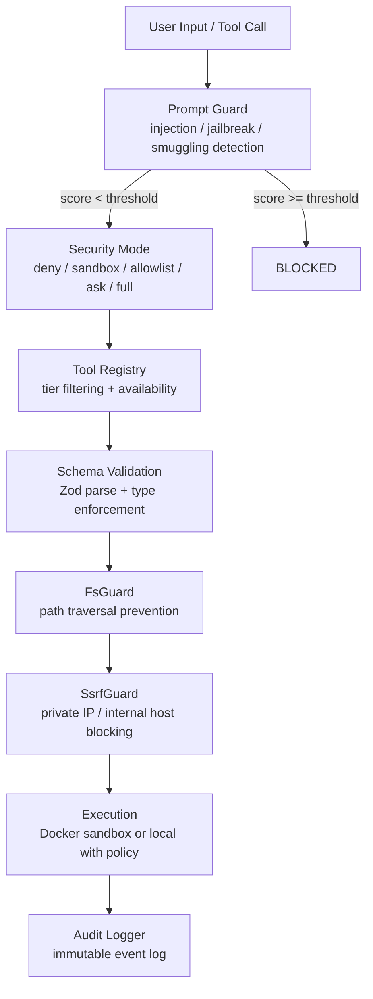
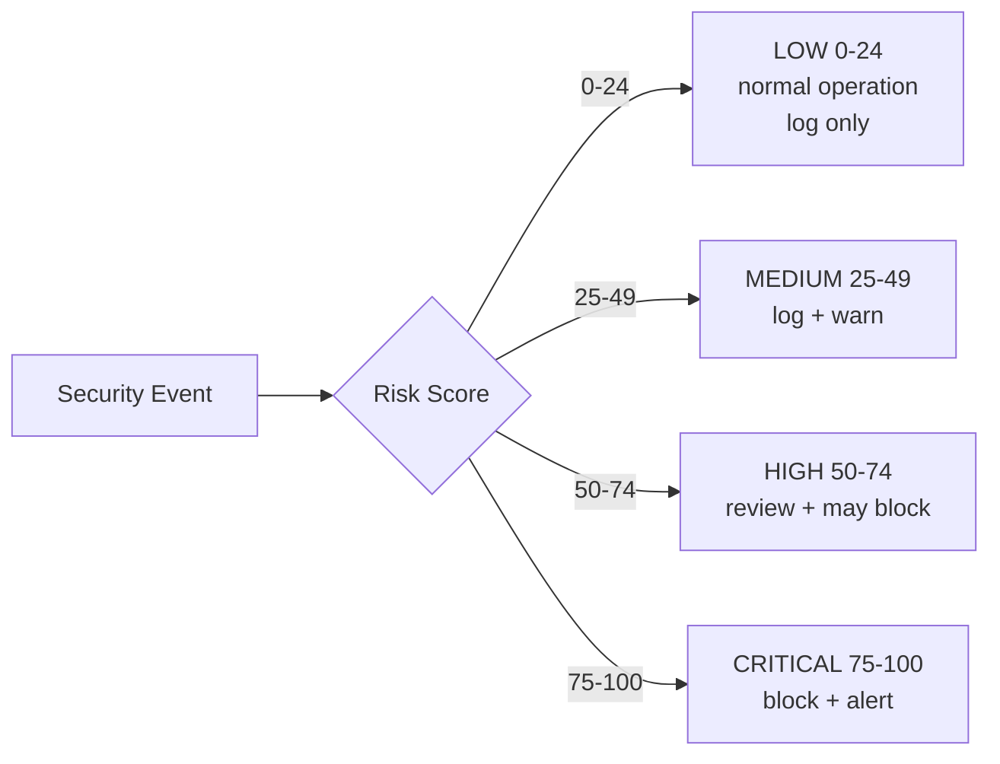

## Security Architecture

profClaw is designed with a defense-in-depth model. Security is enforced at multiple independent layers - a failure in one layer does not compromise the system.



## Security Components

<CardGroup cols={2}>
  <Card title="Security Modes" icon="shield" href="/security/modes">
    Five modes from `deny` (no tools) to `full` (unrestricted). Configured per channel, user, or globally.
  </Card>
  <Card title="Guards" icon="lock" href="/security/guards">
    FsGuard (path traversal), SsrfGuard (SSRF/network), PromptGuard (injection), AuditScanner.
  </Card>
  <Card title="Audit Logging" icon="scroll" href="/security/audit">
    Immutable audit trail of all tool calls, approvals, and security events.
  </Card>
  <Card title="Device Pairing" icon="qrcode" href="/security/device-pairing">
    QR code pairing and DM verification for unknown senders.
  </Card>
  <Card title="Plugin Sandbox" icon="cube" href="/security/plugins">
    Permission model for plugins, static code scanning, and trust tiers.
  </Card>
</CardGroup>

## Security Modes

profClaw supports five security modes. The active mode applies globally but can be overridden per user or per chat channel.

| Mode | Tools Available | Write/Exec Behavior | Best For |
|------|----------------|---------------------|----------|
| `deny` | None | All tool calls blocked | Read-only chat, unknown users |
| `sandbox` | Limited | Docker-isolated execution only | Untrusted input, shared deployments |
| `standard` | Standard tier | Reads auto-approved; writes shown to user | Most deployments (default) |
| `ask` | Full tier | All write/exec operations require approval | Production, sensitive codebases |
| `full` | Full tier | All tools execute without prompts | Trusted local development only |

<Warning>
  `full` mode disables all approval gates. Only use it in environments where every user with access is fully trusted. Never expose `full` mode to public-facing endpoints.
</Warning>

Configure globally or per-channel:

```yaml
# settings.yml
security:
  mode: standard           # global default
  channels:
    slack:
      mode: ask            # stricter for Slack
    webchat:
      mode: standard
```

## Risk Levels

All security events are classified by a numeric risk score. Scores are computed by the PromptGuard and AuditScanner based on detected patterns.

| Level | Score | Default Behavior |
|-------|-------|-----------------|
| `LOW` | 0-24 | Logged only |
| `MEDIUM` | 25-49 | Logged, surfaced in audit dashboard |
| `HIGH` | 50-74 | Logged, may block depending on active mode |
| `CRITICAL` | 75-100 | Blocked and alerts sent |



## Default Security Configuration

Out of the box, profClaw runs in `standard` mode. These are the defaults applied when no `security:` block is present in `settings.yml`:

```yaml
security:
  mode: standard          # standard is safe for most deployments
  fsGuard:
    enabled: true
    allowedPaths:
      - "{{ workdir }}"   # project directory
      - "{{ tmpdir }}"    # system temp
  ssrfGuard:
    enabled: true
    allowedHosts: []      # no private/internal hosts by default
  promptGuard:
    enabled: true
    blockThreshold: 25    # block inputs scoring >= 25
    warnThreshold: 10
  auditLog:
    enabled: true
    retention: 90         # days
```

## Security Responsibilities

| Layer | Your Responsibility | profClaw's Default |
|-------|--------------------|--------------------|
| Network | Set `allowedHosts` for external services | Block all private IPs via SsrfGuard |
| Filesystem | Extend `allowedPaths` for needed directories | Block secrets, system files, parent paths |
| Authentication | Configure your auth provider | Verify tokens per request |
| Secrets | Store in env vars, not settings.yml | Never log or expose key values |
| Models | Choose trusted AI providers | Validate all tool call parameters with Zod |

## Hardening Checklist

<AccordionGroup>
  <Accordion title="For production deployments">
    - Set `security.mode` to `ask` or `strict`
    - Set `WEBHOOK_BASE_URL` to your actual domain (not localhost)
    - Restrict chat channels with `allowedChannels` and `allowedUsers`
    - Set `ssrfGuard.allowedHosts` explicitly if the agent needs to call internal APIs
    - Enable device pairing for unknown sender verification
    - Review audit logs regularly with `profclaw logs --audit`
  </Accordion>
  <Accordion title="For shared or multi-tenant deployments">
    - Use `sandbox` mode to isolate tool execution in Docker containers
    - Set per-user rate limits via `RATE_LIMIT_*` env vars
    - Enable plugin sandboxing for any untrusted plugins
    - Use separate API keys per tenant where possible
  </Accordion>
  <Accordion title="For local development">
    - `standard` mode is safe and is the recommended default even locally
    - `full` mode is only appropriate for solo developer machines with no external access
    - Run `profclaw doctor --security` to verify your configuration
  </Accordion>
</AccordionGroup>

## Reporting Security Issues

Found a vulnerability? Email: security@profclaw.ai

Please do not open public GitHub issues for security vulnerabilities. We aim to respond to security reports within 48 hours.
