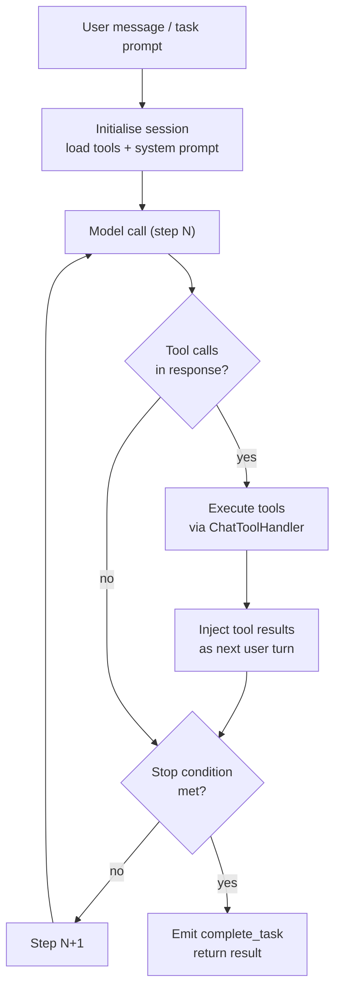
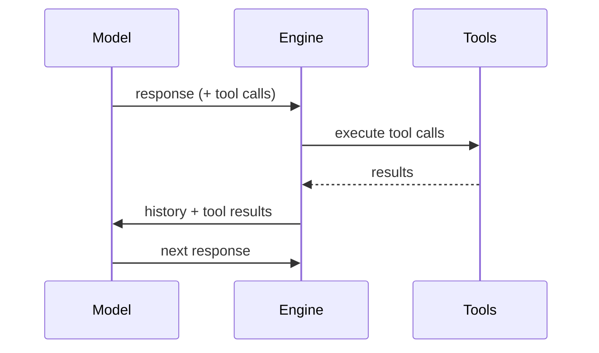
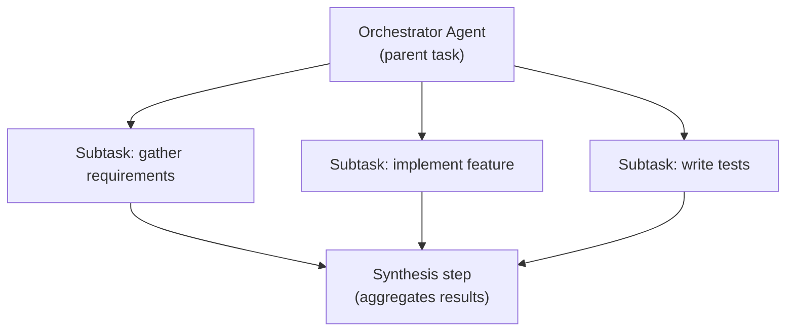

The agentic loop is the execution model that transforms a single user prompt into a sequence of model calls, tool invocations, and self-corrections. Understanding how it works helps you write better prompts, tune budgets, and debug unexpected behaviour.



## Multi-Step Autonomous Execution

Each "step" is one round-trip to the model. The engine supports up to **100 steps** by default before halting with a `step_limit` stop event. The limit can be raised per-call with the `maxSteps` option, up to 200 steps in `max` effort mode.

```typescript
await streamAgenticChat({
  maxSteps: 150,     // override default 100
  effort: 'high',    // 'low' | 'medium' | 'high' | 'max'
  ...
});
```

| Effort | Default Max Steps |
|--------|------------------|
| `low` | 5 |
| `medium` | 20 |
| `high` | 50 |
| `max` | 200 |

<Note>
The step limit is a safety rail, not a performance target. Most tasks complete in under 20 steps. If you consistently hit the limit, consider breaking the task into subtasks using [Task Decomposition](#task-decomposition).
</Note>

---

## Tool Result Auto-Feedback Loop

When the model emits one or more tool calls, the engine does not return control to the caller. Instead it:

1. Routes each tool call through `ChatToolHandler` (respecting the active `SecurityMode`)
2. Awaits all tool results (parallel execution where order doesn't matter)
3. Appends results to the message history as a synthetic user turn
4. Feeds the updated history back into the model for the next step

This feedback loop is transparent to the model — it sees tool results exactly as if a human typed them in. The model is free to call tools again in its next response, or to produce a final assistant message and stop.



---

## Stop Conditions

The loop ends when any of the following is triggered:

| Condition | Event emitted | Trigger |
|-----------|---------------|---------|
| `complete_task` | `complete_task` | Model emits `<complete_task>` XML tag in output |
| `budget_exceeded` | `error` | Token spend exceeds `maxBudget` |
| `step_limit` | `error` | Step count reaches `maxSteps` |
| `no_tool_calls` | `complete_task` | Model responds with no tool calls (natural termination) |
| `error` | `error` | Unrecoverable tool or model error |

<Note>
`complete_task` via XML tag is the preferred stop mechanism. The system prompt instructs the model to emit `<complete_task>result here</complete_task>` when it has satisfied the user's request. This gives a clean, parseable result.
</Note>

---

## Checkpoint / Resume

For long-running tasks, the engine writes a checkpoint after every step. Checkpoints are stored in LibSQL and include the full message history and step index.

### Creating a Checkpoint

Checkpoints are automatic. You can also force one:

```typescript
await taskManager.checkpoint(taskId);
```

### Resuming

```bash
# Resume a task that was interrupted
profclaw task resume <taskId>
```

Via API:

```http
POST /api/tasks/:id/resume
```

The engine reloads the message history from the checkpoint and continues from the next step. This covers process restarts, server deployments, and budget-pause/resume workflows.

<Warning>
Checkpoints include full message history. For conversations with large tool outputs, checkpoint files can be several MB. Use `profclaw task clear-checkpoints` to reclaim disk space.
</Warning>

---

## Task Decomposition

When a task is too large for a single agentic session, use task decomposition to split it into coordinated subtasks.

### How It Works

The orchestrator agent analyses the high-level goal and emits `task_create` tool calls for each subtask. The queue system picks up each subtask independently. Subtask results are aggregated by the orchestrator in a final synthesis step.



### Enabling Decomposition

```yaml
# settings.yml
agent:
  decomposition:
    enabled: true
    maxSubtasks: 10
    parallelism: 3   # run up to 3 subtasks concurrently
```

Or per-task:

```bash
profclaw task create "Implement OAuth2 login" --decompose --parallel 2
```

See [Multi-Agent Guide](/guides/multi-agent) for a full walkthrough.

---

## Budget Warnings

Token spend is tracked per step. When cumulative spend crosses **80%** of `maxBudget`, the engine emits a `budget_warning` event:

```typescript
{ type: 'budget_warning', percentUsed: 82.3 }
```

The TUI displays this as an amber warning bar. In headless mode it is written to stderr. The agent continues running — the warning is informational. When budget reaches 100% the `budget_exceeded` stop condition fires and execution halts cleanly.

```typescript
// Set a budget ceiling (in USD)
await streamAgenticChat({
  maxBudget: 0.50,  // halt at $0.50 spend
  ...
});
```

<Note>
Budget tracking uses the provider's reported token counts multiplied by the current model pricing. Prices are loaded from `src/providers/pricing.ts` and updated with each release. For real-time cost visibility use `profclaw cost watch`.
</Note>
