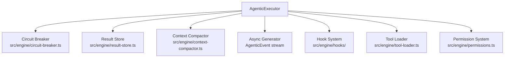
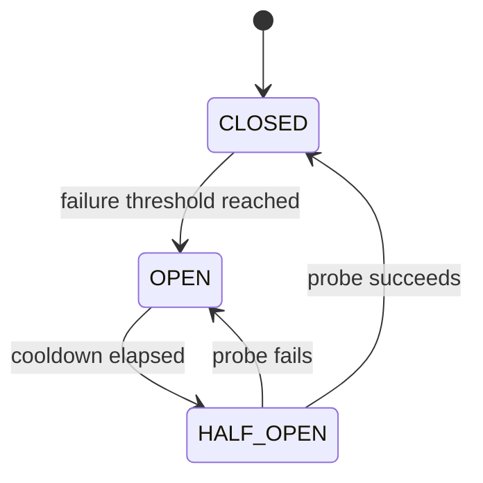

The profClaw engine is the runtime layer beneath the agentic executor. It provides infrastructure that every conversation and task shares: resilient tool invocation, bounded result storage, context-window management, typed event streaming, an extensible hook system, lazy tool discovery, and a multi-tier permission model.



## Circuit Breaker

`src/engine/circuit-breaker.ts` wraps every tool invocation in a three-state machine to prevent cascading failures when a tool or external service degrades.

### States

| State | Behavior |
|-------|----------|
| `CLOSED` | Normal operation — tool calls pass through immediately |
| `OPEN` | Tool is blocked — calls fail-fast without invoking the tool |
| `HALF_OPEN` | Probe state — one call is allowed through to test recovery |



### Configuration

```typescript
interface CircuitBreakerConfig {
  failureThreshold: number;   // default: 5 failures
  cooldownMs: number;         // default: 30_000 ms
  halfOpenProbes: number;     // default: 1
  timeWindowMs: number;       // sliding window, default: 60_000 ms
}
```

### Auto-Recovery

After `cooldownMs` the breaker automatically transitions to `HALF_OPEN`. A single successful probe resets the failure counter and returns to `CLOSED`. This means a temporarily unavailable tool (network blip, rate limit) self-heals without operator intervention.

<Note>
Per-tool breaker state is stored in-process. Restarting profClaw resets all breakers. Use `profclaw status --tools` to inspect current breaker states.
</Note>

---

## Result Store

`src/engine/result-store.ts` buffers tool results between agentic steps so the model can reference earlier outputs without keeping them in the active context window.

### Two-Tier Storage

| Tier | Threshold | Location |
|------|-----------|----------|
| Inline | ≤ 50 KB | In-memory map, serialised into message history |
| Disk spillover | 50 KB – 5 MB | `~/.profclaw/results/<sessionId>/` temp files |

Results larger than 5 MB are truncated with a `[truncated]` notice and a pointer to the raw file for manual inspection.

### Lifetime

Result files are scoped to the conversation session. They are deleted when the session closes or when `profclaw session clear` is run.

```typescript
// Reading a spilled result back into context
const result = await resultStore.get(toolCallId);
// Returns the inline string or reads from disk transparently
```

---

## Context Compactor

Long-running agentic sessions accumulate message history that eventually exceeds the model's context window. The context compactor (`src/engine/context-compactor.ts`) keeps the conversation within budget using a two-phase strategy.

### Phase 1 — Local Heuristic

Before calling the model, the compactor applies deterministic rules:

1. Drop duplicate consecutive tool results
2. Truncate oversized tool outputs to 2 KB summary + pointer
3. Remove tool-call/result pairs older than N steps whose outcome is no longer referenced
4. Keep system prompt, the last K user/assistant turns, and all in-flight tool calls intact

This phase runs synchronously in O(n) time and handles the majority of cases.

### Phase 2 — LLM-Powered Summarisation

When the heuristic alone cannot bring the token count below the budget, the compactor calls a cheap, fast model (configurable via `COMPACTOR_MODEL`) to produce a rolling summary of older turns.

```yaml
# settings.yml
engine:
  contextCompactor:
    budgetFraction: 0.80        # compact when context > 80% of window
    summaryModel: "gpt-4o-mini" # override the summarisation model
    keepLastTurns: 10           # always keep last 10 turns verbatim
```

<Warning>
LLM-powered compaction counts against your token budget. For cost-sensitive workloads, raise `budgetFraction` to 0.95 or disable with `compactor: disabled`.
</Warning>

---

## Async Generator Streaming

`streamAgenticChat()` returns an `AsyncGenerator<AgenticEvent>` — every piece of output is a typed event, not raw text.

### Event Types

```typescript
type AgenticEvent =
  | { type: 'text_delta';       delta: string }
  | { type: 'thinking_delta';   delta: string }
  | { type: 'tool_start';       toolName: string; input: unknown }
  | { type: 'tool_result';      toolName: string; output: unknown; durationMs: number }
  | { type: 'tool_error';       toolName: string; error: string }
  | { type: 'step_complete';    stepIndex: number; usage: TokenUsage }
  | { type: 'budget_warning';   percentUsed: number }
  | { type: 'complete_task';    result: string }
  | { type: 'error';            message: string; code: string };
```

### Consuming the Stream

```typescript
const stream = streamAgenticChat({ ... });

for await (const event of stream) {
  switch (event.type) {
    case 'text_delta':
      process.stdout.write(event.delta);
      break;
    case 'tool_start':
      console.log(`[tool] ${event.toolName}`);
      break;
    case 'complete_task':
      console.log('Done:', event.result);
      break;
  }
}
```

The HTTP layer serialises these events as Server-Sent Events. See [Chat Stream API](/api-reference/chat-stream) for the wire format.

---

## Hook System

The hook system (`src/engine/hooks/`) lets internal subsystems and plugins observe and modify engine behaviour at well-defined points without coupling to core execution logic.

### Registry

```typescript
interface HookRegistry {
  register(hook: Hook): void;
  unregister(hookId: string): void;
  emit<T>(event: HookEvent<T>): Promise<T>;
}
```

Hooks are registered at startup and remain active for the process lifetime. Plugins register hooks via the Plugin SDK.

### Priority

Every hook carries a numeric `priority` (lower = runs first). Built-in hooks use the range 0–99; plugin hooks should use 100+.

```typescript
interface Hook<T = unknown> {
  id: string;
  event: string;
  priority: number;
  handler: (payload: T, context: HookContext) => Promise<T | void>;
}
```

### Built-In Hooks

| Hook ID | Event | Purpose |
|---------|-------|---------|
| `core.audit` | `tool.before` | Write tool call to audit log |
| `core.rate-limit` | `tool.before` | Check provider rate limit headroom |
| `core.sanitize` | `tool.result` | Strip ANSI codes from terminal output |
| `core.redact` | `tool.result` | Remove secrets matching redaction patterns |
| `core.budget` | `step.complete` | Emit `budget_warning` at 80% spend |
| `core.sleep-prevent` | `step.complete` | Keep system awake during long runs |

---

## Deferred Tool Loading

To minimise startup time, tools are split into two groups.

### Core Tools (15, always loaded)

Loaded synchronously at engine init:

| Tool | Description |
|------|-------------|
| `read_file` | Read file contents |
| `write_file` | Write or overwrite a file |
| `edit_file` | Apply targeted string replacement |
| `list_directory` | List directory entries |
| `search_files` | Glob pattern file search |
| `grep` | Regex content search |
| `run_command` | Execute a shell command |
| `git_status` | Git working tree status |
| `git_commit` | Stage and commit changes |
| `web_fetch` | HTTP GET with markdown conversion |
| `web_search` | Web search via configured provider |
| `memory_read` | Read from memory store |
| `memory_write` | Write to memory store |
| `task_create` | Create a profClaw task |
| `task_update` | Update task status or metadata |

### Discoverable Tools (57, loaded on demand)

The remaining tools are registered as manifests in `src/tools/registry/`. The engine resolves the manifest on first call, imports the implementation, and caches it. Subsequent calls are direct.

```typescript
// Tool manifest (no implementation import until first use)
interface ToolManifest {
  name: string;
  description: string;
  category: ToolCategory;
  loader: () => Promise<ToolImpl>;
}
```

<Note>
Use `profclaw tools list --verbose` to see all 72 tools with their load status and category.
</Note>

---

## Permission System

Every tool is assigned a risk tier. The active `SecurityMode` maps tiers to actions.

### Risk Tiers

| Tier | Examples |
|------|---------|
| `safe` | `read_file`, `list_directory`, `memory_read`, `web_fetch` |
| `cautious` | `write_file`, `edit_file`, `git_commit`, `task_create` |
| `dangerous` | `run_command`, `browser_navigate`, `delete_file` |

### SecurityMode Matrix

| Mode | `safe` | `cautious` | `dangerous` |
|------|--------|------------|-------------|
| `deny` | blocked | blocked | blocked |
| `sandbox` | allowed | blocked | blocked |
| `allowlist` | if listed | if listed | if listed |
| `ask` | allowed | prompt user | prompt user |
| `full` | allowed | allowed | allowed |

```typescript
// src/engine/permissions.ts
function checkPermission(
  tool: ToolManifest,
  mode: SecurityMode,
  allowedTools?: string[]
): PermissionResult {
  // Returns: { allowed: boolean; reason?: string }
}
```

<Warning>
`full` mode should only be used for trusted, local, single-user deployments. In multi-user or remote deployments use `ask` or `allowlist`.
</Warning>

See [Security Modes](/security/modes) for configuration details.
