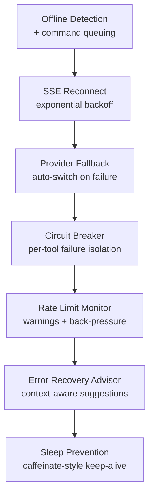

profClaw is designed to keep working under adverse conditions: flaky networks, provider outages, rate limits, and long-running tasks that span system sleep cycles. This page documents every resilience mechanism and how to configure them.



---

## SSE Reconnect with Exponential Backoff

Responses stream over Server-Sent Events (SSE). If the connection drops, the client reconnects automatically using exponential backoff with jitter.

### Reconnect Schedule

| Attempt | Base delay | Jitter | Max delay |
|---------|-----------|--------|-----------|
| 1 | 250 ms | ±50 ms | — |
| 2 | 500 ms | ±100 ms | — |
| 3 | 1 s | ±200 ms | — |
| 4 | 2 s | ±400 ms | — |
| 5+ | doubles | ±20% | 30 s |

Reconnection uses the `Last-Event-ID` header to resume from the last successfully delivered event. The server replays any buffered events from that point — the client never misses output.

```typescript
// Reconnect config (src/chat/sse-client.ts)
const SSE_RECONNECT = {
  maxAttempts:  10,
  baseDelayMs:  250,
  maxDelayMs:   30_000,
  jitterFactor: 0.2,
};
```

<Note>
In the TUI, a disconnected state shows a yellow `[reconnecting...]` banner. The banner clears automatically on successful reconnection with no user action required.
</Note>

---

## Provider Fallback on Failure

When a provider returns a 5xx error, a connection timeout, or an empty response, profClaw can automatically retry on a fallback provider.

### Configuration

```yaml
# settings.yml
providers:
  fallback:
    enabled: true
    strategy: ordered   # 'ordered' | 'round-robin'
    chain:
      - anthropic
      - openai
      - groq
    retryOnStatusCodes: [500, 502, 503, 504, 529]
    timeoutMs: 15_000
```

The fallback chain is tried in order. If all providers fail, the error is returned to the caller.

### Per-Request Override

```bash
profclaw chat -p "..." --fallback "openai,groq"
```

### Fallback Event

When a fallback fires, the engine emits a `provider_fallback` event:

```typescript
{ type: 'provider_fallback', from: 'anthropic', to: 'openai', reason: 'timeout' }
```

This is visible in the TUI tool log and in headless `--json` output.

---

## Offline Detection + Command Queuing

profClaw monitors network connectivity and queues commands when the machine goes offline.

### Detection

Connectivity is checked by probing a configurable health endpoint every 10 seconds:

```yaml
# settings.yml
network:
  offlineProbeUrl: "https://connectivity.profclaw.ai/ping"
  probeIntervalMs: 10_000
  offlineThreshold: 2   # mark offline after 2 consecutive failures
```

### Queuing Behaviour

When offline is detected:

1. New chat messages and task submits are accepted and queued locally
2. The TUI shows an `[offline — N commands queued]` indicator
3. When connectivity returns, queued commands are flushed in order
4. Each command is processed with a fresh SSE connection

```bash
# Inspect the offline queue
profclaw queue list --pending

# Flush manually (if auto-flush didn't trigger)
profclaw queue flush
```

<Warning>
Queued commands use the model and settings active at queue time, not flush time. If you change your API key or provider while offline, queued commands may fail on flush.
</Warning>

---

## Circuit Breaker for Tools

See [Engine Architecture — Circuit Breaker](/architecture/engine#circuit-breaker) for full details. In the context of resilience:

- A tool that repeatedly fails (e.g., a misconfigured web search provider) opens its circuit after 5 failures
- Subsequent calls fail-fast (no network round-trip) until the 30-second cooldown elapses
- This prevents a single broken tool from stalling the entire agentic loop

```bash
# Check circuit breaker states
profclaw status --tools

# Output:
# web_search      OPEN   (5/5 failures, resets in 18s)
# read_file       CLOSED
# git_commit      CLOSED
```

### Manual Reset

```bash
profclaw tools reset-circuit web_search
```

---

## Rate Limit Monitoring

profClaw tracks rate limit headers from every provider response and exposes them through the `core.rate-limit` hook.

### Tracked Metrics

| Metric | Source |
|--------|--------|
| Requests per minute remaining | `x-ratelimit-remaining-requests` |
| Tokens per minute remaining | `x-ratelimit-remaining-tokens` |
| Reset timestamp | `x-ratelimit-reset-requests` |

### Warnings

When remaining capacity drops below 20%, the engine emits a `rate_limit_warning` event and the TUI displays an amber indicator:

```typescript
{ type: 'rate_limit_warning', provider: 'anthropic', metric: 'tokens_per_minute', percentRemaining: 14 }
```

### Automatic Back-Pressure

If remaining tokens drop below 5%, the engine inserts a short delay before the next step to let the window reset. The delay is calculated from the `x-ratelimit-reset-*` header:

```typescript
const delayMs = resetAt - Date.now() + 500;  // +500ms buffer
await sleep(delayMs);
```

This prevents `429 Too Many Requests` errors in long agentic sessions.

---

## Smart Error Recovery Advisor

When a step fails with an unrecoverable error, the advisor analyses the error and suggests the most likely fix before halting.

### Advisory Triggers

| Error | Suggestion |
|-------|-----------|
| `AuthenticationError` | Check `ANTHROPIC_API_KEY` / provider key |
| `ContextWindowExceeded` | Switch to a larger context model |
| `BudgetExceeded` | Increase `--budget` or split into subtasks |
| `StepLimitReached` | Increase `--max-steps` or use `--effort max` |
| `ToolPermissionDenied` | Switch security mode to `ask` |
| `CircuitOpen` | The named tool is in circuit-open state; reset or wait |
| `RateLimitExceeded` | Wait for rate limit window to reset; check `profclaw cost` |
| `NetworkTimeout` | Check connectivity; configure a fallback provider |

Suggestions are printed to stderr in headless mode and displayed as an inline callout in the TUI.

---

## Sleep Prevention During Long Runs

macOS and Linux power management can suspend a machine mid-task. profClaw prevents this during agentic execution.

### macOS

Uses `caffeinate` subprocess (`-i` flag, prevent idle sleep):

```typescript
// src/engine/sleep-prevent.ts
const proc = spawn('caffeinate', ['-i']);
// killed when agentic session ends
```

### Linux (systemd)

Acquires a `systemd-inhibit` lock on systems with `systemd-logind`:

```bash
systemd-inhibit --what=idle --who=profclaw --why="Agentic task running" sleep infinity
```

### Windows

Calls `SetThreadExecutionState(ES_CONTINUOUS | ES_SYSTEM_REQUIRED)` via a native addon.

### Configuration

```yaml
# settings.yml
engine:
  sleepPrevention:
    enabled: true          # default: true
    minStepsToEnable: 5    # only activate for tasks > 5 steps
```

<Note>
Sleep prevention is automatically released when the agentic session completes, errors, or is cancelled. If profClaw exits abnormally, the OS resumes normal sleep behaviour after its own timeout.
</Note>
