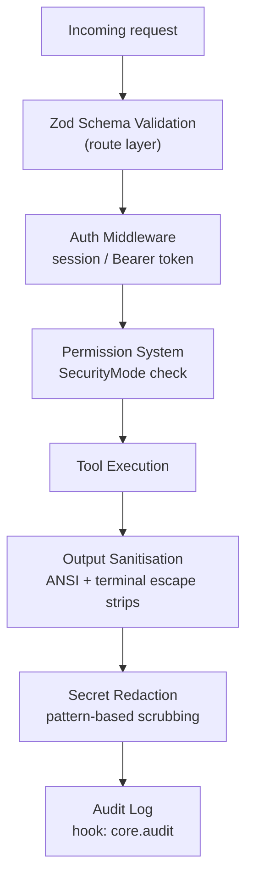

Security in profClaw is layered — each layer is independently effective, and together they defend against the most common attack vectors when running an AI agent with tool access.



---

## Request Validation

Every HTTP route uses Zod schemas to validate input before any business logic runs. Malformed or unexpected fields are rejected with a `400` and a structured error body — the AI model never sees invalid input.

```typescript
// Example route schema (src/routes/chat.ts)
const chatSchema = z.object({
  message:        z.string().min(1).max(100_000),
  conversationId: z.string().uuid().optional(),
  model:          z.string().max(128).optional(),
  provider:       z.string().max(64).optional(),
  maxSteps:       z.number().int().min(1).max(200).optional(),
  maxBudget:      z.number().positive().max(100).optional(),
});
```

Field-level validation catches:
- Oversized payloads (message max 100 KB)
- Invalid UUIDs that could cause SQL injection via ORM misuse
- Out-of-range numeric values (steps, budget)
- Unexpected extra fields (stripped by `z.object().strict()` on sensitive routes)

---

## Terminal Output Sanitisation

Tool outputs that involve terminal execution (`run_command`, `test_runner`, `browser_navigate`) are passed through `src/engine/sanitize.ts` before being injected into the model context.

### What is Stripped

| Category | Examples |
|----------|---------|
| ANSI colour codes | `\x1b[31m`, `\x1b[0m` |
| Terminal control sequences | `\x1b[2J` (clear screen), `\x1b[?1049h` (alternate buffer) |
| Cursor movement codes | `\x1b[A`, `\x1b[2K` |
| OSC sequences | `\x1b]0;title\x07` (terminal title set) |
| Hyperlink escape sequences | `\x1b]8;;url\x07` |

Stripping these prevents the model from being manipulated by crafted terminal output that attempts to inject instructions or obscure real output.

<Warning>
Even with sanitisation, do not run `run_command` against untrusted repositories or user-supplied shell commands without `--security sandbox` or `--security ask`. The sanitiser removes cosmetic escapes, not malicious command output content.
</Warning>

---

## Path Traversal Prevention

All file-access tools (`read_file`, `write_file`, `edit_file`, `list_directory`) validate the resolved path against a configurable allowlist before any filesystem operation.

```typescript
// src/tools/file-ops/guard.ts
function assertAllowedPath(rawPath: string): string {
  const resolved = path.resolve(rawPath);

  // Reject null bytes
  if (resolved.includes('\0')) throw new ToolError('PATH_NULL_BYTE');

  // Reject traversal outside allowed roots
  const allowed = getAllowedRoots();   // from settings + env
  const inBounds = allowed.some(root => resolved.startsWith(root));
  if (!inBounds) throw new ToolError('PATH_OUTSIDE_ALLOWED_ROOT');

  return resolved;
}
```

### Configuring Allowed Roots

```yaml
# settings.yml
security:
  allowedPaths:
    - /home/user/projects
    - /tmp/profclaw-workspace
```

```bash
export PROFCLAW_ALLOWED_PATHS="/home/user/projects:/tmp/workspace"
```

If no `allowedPaths` are configured, the default root is the current working directory at process start.

---

## Shell Command Sanitisation

When `run_command` is permitted, arguments are sanitised to prevent shell injection via model-generated commands.

- Commands are executed via `execa` (never `child_process.exec` with a shell) — no shell metacharacter expansion
- Arguments are passed as an array, not a concatenated string
- The working directory is validated through the path guard
- A configurable blocklist prevents known dangerous patterns (`rm -rf /`, `dd if=/dev/`, `mkfs`, etc.)

```typescript
// Blocked patterns (src/tools/run-command/blocklist.ts)
const BLOCKED_PATTERNS = [
  /rm\s+-rf\s+\/(?!\S)/,        // rm -rf /
  /dd\s+if=\/dev\//,             // dd from raw device
  /mkfs\./,                      // filesystem format
  /:\s*\(\s*\)\s*\{.*\}/,       // fork bomb
  /curl.*\|\s*(?:sh|bash)/,     // curl-pipe-shell
];
```

---

## Sensitive Value Redaction

Before tool results are injected into the model context, the redaction hook (`core.redact`) scrubs values matching known secret patterns.

### Built-In Patterns

| Pattern | Matches |
|---------|---------|
| `sk-[a-zA-Z0-9]{40,}` | OpenAI / Anthropic API keys |
| `ghp_[a-zA-Z0-9]{36}` | GitHub personal access tokens |
| `AKIA[A-Z0-9]{16}` | AWS access key IDs |
| `eyJ[a-zA-Z0-9._-]{40,}` | JWT tokens |
| `-----BEGIN.*PRIVATE KEY-----` | PEM private keys |
| Hex strings 32–64 chars after `secret=`, `key=`, `token=` | Generic secrets |

Matched values are replaced with `[REDACTED:<type>]`.

### Custom Patterns

```yaml
# settings.yml
security:
  redaction:
    customPatterns:
      - name: "internal-api-key"
        pattern: "CORP_[A-Z0-9]{32}"
      - name: "db-password"
        pattern: "(?i)password[\"']?\\s*[:=]\\s*[\"']?([^\\s\"']+)"
        group: 1    # redact capture group 1 only
```

---

## Permission System

Every tool carries a risk tier (`safe`, `cautious`, `dangerous`). The active `SecurityMode` determines whether each tier is allowed, blocked, or requires user approval.

For full permission matrix details, see [Engine Architecture — Permission System](/architecture/engine#permission-system).

### Tool-Level Approval (`ask` mode)

In `ask` mode, cautious and dangerous tool calls create a `PendingApproval` record. The TUI displays an inline approval prompt:

```
  profClaw wants to run: write_file
  Path: src/auth/session.ts
  [A]pprove  [D]eny  [S]kip (deny once)  [?] Show full input
```

Approvals can also be granted via API for programmatic workflows:

```http
POST /api/security/approvals/:id
Content-Type: application/json

{ "decision": "approve" }
```

---

## Hook-Based Audit Logging

The `core.audit` hook fires on every tool invocation (`tool.before` and `tool.after` events) and writes a structured entry to the audit log.

### Log Entry Format

```json
{
  "ts":           "2026-04-02T08:31:00.000Z",
  "sessionId":    "sess_abc123",
  "userId":       "usr_xyz",
  "conversationId": "conv_def456",
  "event":        "tool.call",
  "toolName":     "write_file",
  "tier":         "cautious",
  "securityMode": "ask",
  "decision":     "approved",
  "durationMs":   42,
  "success":      true
}
```

### Destinations

```yaml
# settings.yml
security:
  audit:
    enabled: true
    destinations:
      - type: file
        path: /var/log/profclaw/audit.jsonl
        rotate: daily
      - type: db          # stored in LibSQL audit_log table
        enabled: true
      - type: webhook
        url: https://your-siem.internal/events
        secret: "${AUDIT_WEBHOOK_SECRET}"
```

Query the audit log:

```bash
profclaw audit --tail 50
profclaw audit --tool write_file --since 1h
profclaw audit --user usr_xyz --json | jq '.[] | select(.success == false)'
```

See [Audit Log Reference](/security/audit) for the full query API.
